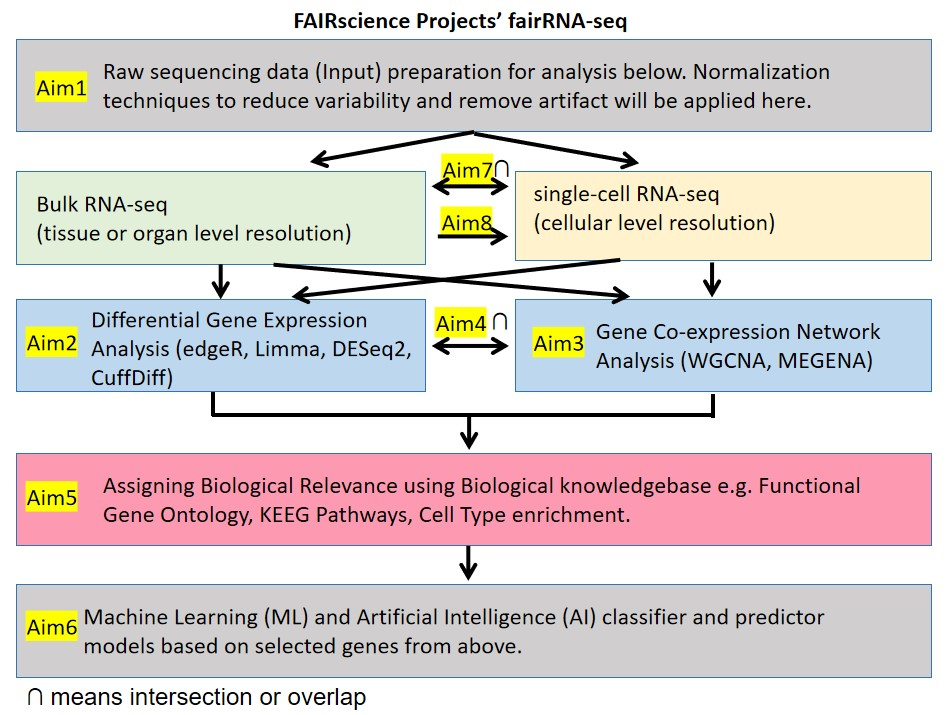

############################################################################################################################
# INTRODUCTION
############################################################################################################################
# This project is part of FAIRwissenschaft project (see FAIRwissenschaft_README.md file for details)  
# title: "fairRNAseq"
# author: "Shradha Mukherjee"
# status: work in progress (ongoing project)
# date created: "February 24, 2024"
# date last updated: "March 3, 2024"
# submission: Initial Submission "February 24, 2024"  

## Goal (What?): To develop reproducible integrated bioinformatics pipeline for RNA-seq.  

## Significance (Why?): For FAIR RNAseq and fair RNAseq.  

FAIR is acronym for Findable, Accessible, Interoperable and Reusable. FAIR https://www.ebi.ac.uk/about/news/perspectives/fairification-framework-making-your-data-findable-accessible-interoperable-and-reusable/
Tier one journals covering all scientific domains and with more than journal published under their umbrella, are Nature, Cell and Frontiers family of journals. Commonly, even when extensive computation is used in their papers, authors do not provide codes during review process and even for final publication Example https://biologicalproceduresonline.biomedcentral.com/articles/10.1186/s12575-022-00175-x. In instances where codes are provided, commonly they are error prone or incomplete, the authors often try to excuse themselves by saying its been a long time since the codes were run, when in reality its not been that long and/or it never actually worked to begin with, Example https://github.com/mgandal/Shared-molecular-neuropathology-across-major-psychiatric-disorders-parallels-polygenic-overlap. Also authors try to excuse themselves from their duty to provide code and data, by stating its human data when in reality de-identified data sharing is standard practice in science. This is a breach of contract with funding agencies who fund the research, who require that once the funded research is completed its published in its entirety (data, methods and results). Works that cannot be verified or reused with citation, are useless for academic, industrial or biomedical science because only rigorous research or FAIR research can be used for applications in human health and environmental health. In biological sciences, say for western blot there is a standard protocol that is used by everyone and any changes needed such as incubation with primary antibody overnight or 6 hours is reported, which makes works that follow this method, verifiable and reproducible, ergo FAIR and useful. Similarly, there needs to be a standard protocol for bioinformatics analysis and this project is an attempt towards that goal. This reproducibility and reusability problem, is not limited to scientific data, techniques and discoveries but also applies to humanities i.e. economics/law/journalism/arts, knowledge domains. Therefore, broadly speaking its not FAIR science peoject but FAIR wissenschaft project.  

Fair or just, is giving credit where its due to original work and protecting against plagiarism (use of original work without citation and/or permission). One way to protect against plagiarism is to increase visibility of the original work and make the original work standard practice. Making original work standard practice in science, protects original against plagiarism as original gets applied more in turn gets cited more than plagiarised versions. Example: WGCNA original pipeline https://cran.r-project.org/web/packages/WGCNA/index.html has been extensively plagiarised by other pseudo-WGCNA pipelines that claim to be a new WGCNA invention and repackage a plagiarised version of WGCNA as their own R/bioconductor package. Original WGCNA being a standard well established method has been extensively used to make it robust. These pseudo-WGCNA pipelines create confusion in science, as these pseudo-WGCNA pipelines are error prone and unreliable. Examples of pseudo-WGCNA are, multiWGCNA https://github.com/fogellab/multiWGCNA, GWENA https://bioconductor.org/packages/release/bioc/html/GWENA.html, BioNero https://bioconductor.org/packages/release/bioc/html/BioNERO.html and hdWGCNA https://smorabit.github.io/hdWGCNA, to name a few. If these pseudo-WGCNA represent plagiarism, then what is reasonable use with citation? Sadly, pseudo-WGCNA is more common in science and reasonable use with citation is rare. Infact, I can only give my own example for reasonable use of WGCNA with citation to original WGCNA work. I myself have used WGCNA (https://github.com/smukher2/GithubScientificReportsGlioblastomaStemApril2020, 
https://github.com/smukher2/GithubSubmittedADPDHDMSimmuneSept2021 and 
https://github.com/smukher2/GithubFrontiersNeurosciDec2018), and I will use it here in this project, but I cited original WGCNA scientists prominently and never claimed in my publications/presentations/verbally that I invented WGCNA pipeline, novelty of my work being integration of WGCNA into another pipeline and application of this for my research question. This plagiarism problem, is not limited to scientific data, techniques and discoveries but also applies to humanities i.e. economics/law/journalism/arts, knowledge domains. Therefore, broadly speaking its not fair science project but fair wissenschaft project.

This project of developing a standardized RNA-seq pipeline is an effort to make scientific research FAIR (reproducible) and fair (give credit where its due to originals). Funding agencies and journals can ofcourse enforce publication of codes, usage of FAIR science and stop plagiarism, but I am a nobody so I have no control over their decisions/free will.  

## Specific Aims (What?) and Methods Overview (How?):  
### Aim1: A) For bulk RNA-seq B) For single-cell RNA-seq (scRNA-seq):  
To develop an integrated pipeline for converting raw data (sequencer data) to normalized gene expression data.  

### Aim2: A) For bulk RNA-seq B) For single-cell RNA-seq (scRNA-seq):  
To develop an integrated pipeline for DGE (differential gene expression) analysis using multiple methods (edgeR, limma, DESeq2, simple comparison of means, cuffDiff).  

### Aim3: A) For bulk RNA-seq B) For single-cell RNA-seq (scRNA-seq):
To develop an integrated pipeline for GCN (gene co-expression network) analysis using multiple methods (WGCNA, MEGENA).  

### Aim4: A) For bulk RNA-seq B) For single-cell RNA-seq (scRNA-seq):  
To develop an integrated pipeline to overlap DGE (Aim2) and GNA (Aim3).  

### Aim5: A) For bulk RNA-seq B) For single-cell RNA-seq (scRNA-seq):  
To develop an integrate pipeline for interpretation of biological relevance of a gene list i.e. list of genes selected in Aim2, Aim3 and/or Aim4.  

### Aim6: A) For bulk RNA-seq B) For single-cell RNA-seq (scRNA-seq):  
To develop an integrate pipeline for Machine Learning (ML) and Artificial Intelligence (AI) classifier models based on biomarker genes i.e. list of genes selected in Aim2, Aim3, Aim4 and/or Aim5.  

### Aim7: A) From single-cell RNA-seq to bulk RNA-seq:   
To develop an integrated pipeline for overlapping scRNA-seq and bulk RNA-seq.  

### Aim8: B) From bulk RNA-seq to single-cell RNA-seq (scRNA-seq):  
To develop an integrated pipeline for predicting scRNA-seq response based on bulk RNA-seq response using Machine Learning (ML) and Artificial Intelligence (AI) for gene perturbation (e.g. gene editing with Crispr-Cas9), and chemical treatment (e.g. pharmaceutical drugs, environmental toxins).  

############################################################################################################################
# INPUT (DATA SOURCE)
############################################################################################################################
######University/Institute/Organization employee (boss/PI and staff profile) and scientific literature. Results of poor scoring untalented/poor performer/deceitful/parasites and talented/high performer/host will be published in this repository and HAL repository.######

############################################################################################################################
# OUTPUT (DATA SOURCE)
############################################################################################################################
######Mock result showing format of output, in 'output_tmp' folder, mock file 'ransackai_mock_result.csv' (also excel format 'ransackai_mock_result.xlsx'). In simple words using generative AI a brief explanation will be added to make it explainable AI and also some back of the envelope formula or math explanation will be added (it woun't be as accurate as the AI calculated score but something approximate to make it more explainable). Author IDs such as Orcid will be used to identify authors so that incase of name change author can still be tracked and scored. Ranks will be both statistical ranks and also ML model predicted ranks. ######

############################################################################################################################
# SETUP
############################################################################################################################
#####Install Anaconda on your Mac or Linux Operating System#####
https://docs.anaconda.com/anaconda/install/index.html
######Create conda environment for R and IDE RStudio#####
#here env name being created is 'ransackai', please use any name you like
conda create --clone base --name ransackai
conda activate ransackai
#Type following to exit conda env
conda deactivate

############################################################################################################################
# USE
############################################################################################################################
######Commandline Usage######

######IDE Usage######

############################################################################################################################
# FUTURE DIRECTION
############################################################################################################################
Future direction: To develop reproducible integrated bioinformatics pipeline, like the one developed for RNA-seq above, for other omics data such as ChIP-seq (chromatin immunoprecipitation sequencing), WGS (whole genome sequencing) and proteomics.  

############################################################################################################################
# THANK YOU
############################################################################################################################

# Copyright ©2023-2024 Shradha Mukherjee. All rights reserved. 